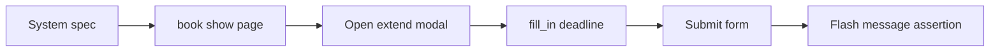

# 設計書

## アーキテクチャ概要

既存の Rails + Capybara system spec 構成のまま、テストコードの入力方式のみ変更する。



## コンポーネント設計

### 1. 期限延長システムスペック

**責務**:
- 期限延長モーダルの操作を E2E で検証
- 期限入力後の成功メッセージ表示を検証

**実装の要点**:
- `type="date"` への値設定を JS 直接代入から `fill_in` に変更
- 既存の `within` スコープと期待値は維持

### 2. テスト実行検証

**責務**:
- 対象スペックの通過確認
- スタイル規約の確認

**実装の要点**:
- `bundle exec rspec spec/system/books/deadline_spec.rb`
- `bundle exec rubocop spec/system/books/deadline_spec.rb`

## データフロー

### 期限延長（成功ケース）
```
1. ユーザーが期限延長モーダルを開く
2. date input に新しい期限を入力する
3. 「延長する」を押して PATCH /books/:id/change_deadline を送信
4. show にリダイレクトされ成功フラッシュが表示される
```

## エラーハンドリング戦略

### テストコード側

- Capybara の待機機構に任せ、不要な JS 直接操作を避ける
- DOM 操作に依存しすぎる記述を減らし、ユーザー操作に近づける

## テスト戦略

### ユニットテスト
- 変更なし

### 統合テスト
- `spec/system/books/deadline_spec.rb` の対象ケースを確認

## 依存ライブラリ

追加なし

## ディレクトリ構造

```
.steering/20260412-fill-in-fix/
  requirements.md
  design.md
  tasklist.md
spec/system/books/deadline_spec.rb   # 変更
```

## 実装の順序

1. ステアリングファイルを作成
2. `deadline_spec.rb` の入力方式を `fill_in` に変更
3. RSpec / RuboCop 実行
4. implementation-validator で検証
5. 振り返りを `tasklist.md` に記録

## セキュリティ考慮事項

- テストコード変更のみで、セキュリティ影響はなし

## パフォーマンス考慮事項

- flaky による再試行コストを削減し CI 安定性を向上

## 将来の拡張性

- 将来 date input の UI 実装が変わっても、`fill_in` ベースの記述は比較的保守しやすい
