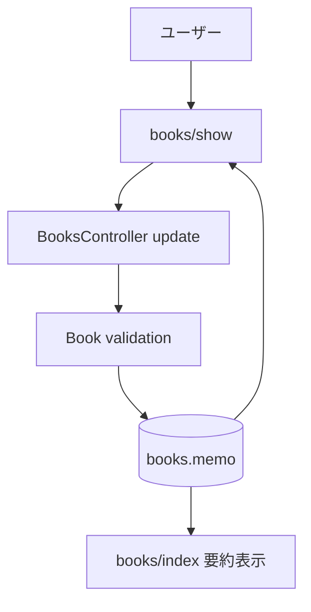

# 設計書

## アーキテクチャ概要

RailsのMVCを維持し、Bookモデルにメモ属性を追加する。入力はBooksController経由で更新し、表示はERBテンプレートで安全にエスケープして行う。



## コンポーネント設計

### 1. Bookモデル

責務:
- コメント・メモ本文の永続化
- 文字数バリデーション

実装の要点:
- `memo`（text）カラムを追加
- 上限文字数は要件に合わせてモデルバリデーションで制御

### 2. BooksController

責務:
- メモ入力を許可パラメータで受け取り保存

実装の要点:
- `book_params` に `memo` を追加
- 既存の更新フローを壊さない

### 3. View（詳細/一覧）

責務:
- 詳細画面で編集・表示
- 一覧画面で要約表示

実装の要点:
- 詳細画面は `simple_format` で改行を保持しつつHTMLエスケープを維持
- 一覧画面は `truncate` で先頭文字列を表示
- 空文字時はプレースホルダ文言または非表示でUI崩れを防止

## データフロー

### メモの保存
1. ユーザーが書籍詳細画面でメモを入力
2. 更新リクエストで `memo` を送信
3. コントローラが `book_params` で受け取りBookを更新
4. 保存後に再描画し、詳細/一覧へ反映

## エラーハンドリング戦略

### モデルバリデーションエラー

- 文字数超過時は `@book.errors` に追加して既存のフォームエラー表示を利用する

### 不正入力

- 表示はERBの自動エスケープを前提にし、HTMLは実行させない

## テスト戦略

### ユニットテスト
- Bookの`memo`文字数バリデーション

### 統合テスト
- request specでメモの新規保存・更新・空値更新
- request specで一覧/詳細への反映

## 依存ライブラリ

新規ライブラリ追加なし。

## ディレクトリ構造

```text
db/migrate/*_add_memo_to_books.rb
app/models/book.rb
app/controllers/books_controller.rb
app/views/books/show.html.erb
app/views/books/index.html.erb
spec/models/book_spec.rb
spec/requests/books_spec.rb
spec/requests/books_index_spec.rb
```

## 実装の順序

1. DBマイグレーションで `books.memo` を追加
2. モデル/コントローラで保存ロジックを反映
3. 詳細・一覧画面に入力/表示UIを追加
4. model/request specを追加・修正
5. テストとLintを実行して修正

## セキュリティ考慮事項

- メモ表示はエスケープされたHTMLとして扱う
- 一覧要約表示時も生HTMLを描画しない

## パフォーマンス考慮事項

- 一覧表示は既存Bookクエリにmemo列が追加されるのみでN+1は増やさない

## 将来の拡張性

- 将来的にタグ付けやメモ検索を追加しやすいようBook単位の単純なtextカラムで開始する
