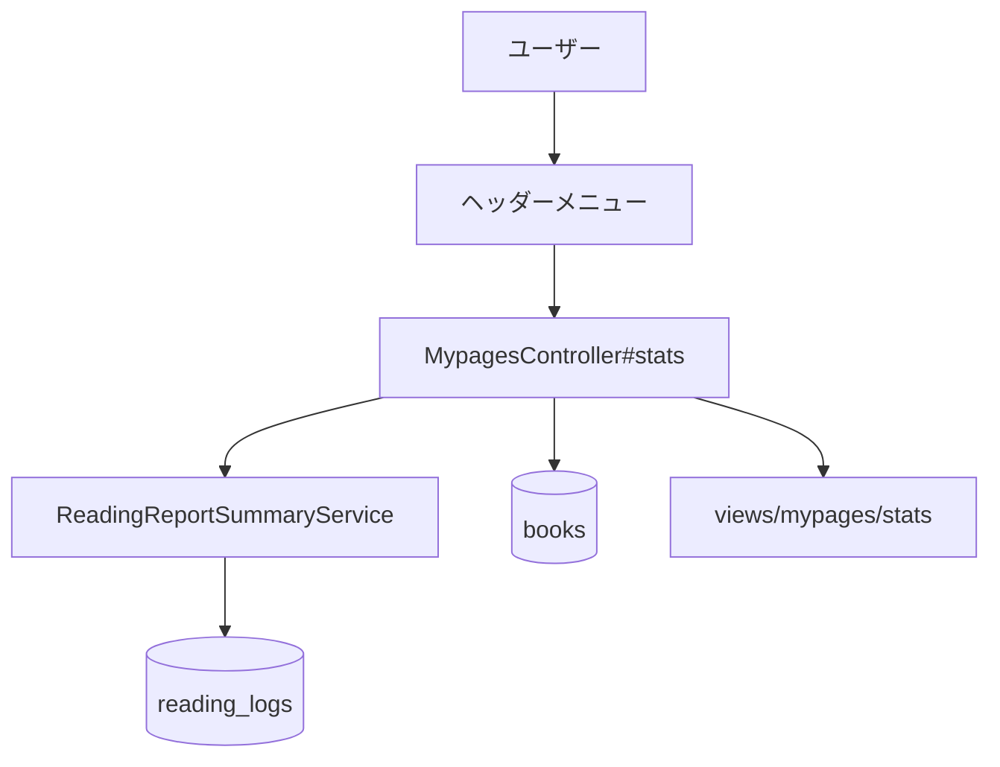

# 設計書

## アーキテクチャ概要

既存のRails MVC構成を維持し、`ReadingReportSummaryService` を再利用して読書統計ページを実装する。コントローラーは期間パラメータを正規化し、ビューで統計カードと書籍別一覧を表示する。



## コンポーネント設計

### 1. MypagesController#stats

責務:
- 期間種別（weekly/monthly）の解釈とフォールバック
- 統計表示に必要な集計データの準備

実装の要点:
- `params[:period]` が `weekly` / `monthly` の場合のみ採用
- `ReadingReportSummaryService` から総ページ数・書籍別ページを取得
- `Book.completed` を期間で絞って読了冊数を算出
- 平均ページ/日は期間日数で割って整数丸め

### 2. 統計ビュー（app/views/mypages/stats.html.erb）

責務:
- 週次・月次切り替えUI
- 統計値と書籍別内訳の表示

実装の要点:
- 期間タブをリンクで実装（JS不要）
- データなし時は「0」や「該当なし」を表示
- 書籍別内訳は最大値比率でバー表示

### 3. ヘッダーメニュー

責務:
- 統計ページへの導線追加

実装の要点:
- 既存ドロップダウンに「読書統計」リンクを追加

## データフロー

### 読書統計ページ表示
1. ユーザーがヘッダーから統計ページへ遷移
2. `period` パラメータをコントローラーで解釈（不正値は `weekly`）
3. `ReadingReportSummaryService` が期間内 `reading_logs` を集計
4. コントローラーで読了冊数・平均ページ/日を補完してビューに渡す
5. ビューが統計カードと書籍別内訳を描画

## エラーハンドリング戦略

### 期間パラメータ不正値

- 例外化せず `weekly` にフォールバック

### データ欠損

- 対象データがない場合は空配列と0値を表示し、HTTP 200を維持する

## テスト戦略

### ユニットテスト
- 既存 `ReadingReportSummaryService` のspecを再利用（新規追加なし）

### 統合テスト
- request specで `GET /mypage/stats` の週次・月次表示を検証
- period切り替え時の集計値を検証
- データなし時の表示、未ログイン時リダイレクトを検証

## 依存ライブラリ

新規ライブラリ追加なし。

## ディレクトリ構造

```text
config/routes.rb
app/controllers/mypages_controller.rb
app/views/mypages/stats.html.erb
app/views/shared/_header.html.erb
app/assets/stylesheets/mypages.css
spec/requests/mypages_stats_spec.rb
spec/requests/header_footer_spec.rb
```

## 実装の順序

1. ルーティングとコントローラーの統計アクション追加
2. 統計ページビューとスタイル追加
3. ヘッダーメニューに導線追加
4. request spec追加・既存spec調整
5. 実装検証とテスト実行

## セキュリティ考慮事項

- 統計クエリは `current_user` のデータに限定する
- `period` パラメータは許可値のみ受け付ける

## パフォーマンス考慮事項

- 既存 `ReadingReportSummaryService` のDB集計を活用してN+1を避ける
- 読了冊数集計は期間と `current_user` に限定して走査範囲を絞る

## 将来の拡張性

- `stats` アクションに任意期間や年次表示を追加しやすいよう、期間解釈と指標計算をprivateメソッドに分離する
