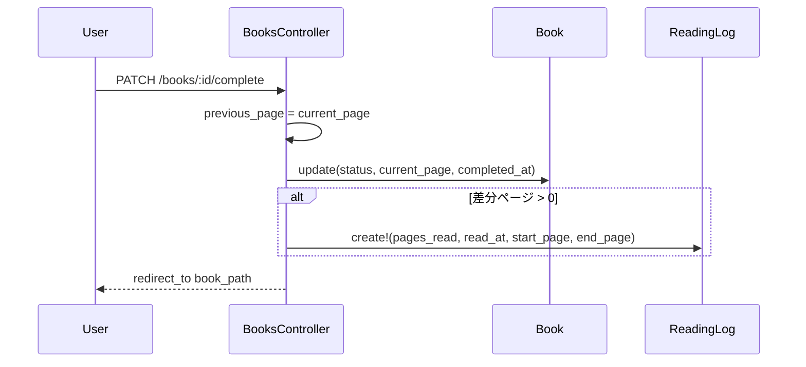

# 設計書

## アーキテクチャ概要

Railsの既存MVC構成を維持し、コントローラー層の `BooksController#complete` に差分ReadingLog作成処理を追加する。
既存の `update_progress` で採用している `reading_logs` 記録形式（`read_at`, `start_page`, `end_page`, `pages_read`）に合わせ、統計サービスとの整合を保つ。



## コンポーネント設計

### 1. BooksController#complete

**責務**:
- 読了状態への更新
- 読了時の未記録差分ページのReadingLog記録

**実装の要点**:
- 更新前ページ（`previous_page`）を先に保持する
- 更新成功時のみ差分ログ作成を試みる
- 差分が0以下の場合はログ作成をスキップ

### 2. Request Spec（PATCH /books/:id/complete）

**責務**:
- 差分ReadingLog作成の回帰防止
- 差分0時の非作成保証

**実装の要点**:
- `change(ReadingLog, :count)` で作成有無を検証
- 作成ログの属性（ページ範囲・ページ数）を明示検証

## データフロー

### 読了ボタン押下
1. 書籍の `current_page` を保持
2. 書籍を `completed` + `current_page = target_pages` で更新
3. `target_pages - previous_page` を差分として算出
4. 差分が正のときのみReadingLogを作成

## エラーハンドリング戦略

### カスタムエラークラス

新規追加なし。既存のRails例外処理に従う。

### エラーハンドリングパターン

- 書籍更新失敗時: 既存どおり `render :show, status: :unprocessable_entity`
- ReadingLog作成失敗時: 本Issueの範囲では既存挙動を壊さない最小変更を優先し、まずは例外を発生させない条件分岐で堅牢化する

## テスト戦略

### ユニットテスト
- 追加なし（本変更はコントローラアクションの挙動修正が中心のため）

### 統合テスト
- `PATCH /books/:id/complete` で差分ReadingLogが作成されること
- `PATCH /books/:id/complete` で差分0の場合にReadingLogが増えないこと

## 依存ライブラリ

追加なし。

## ディレクトリ構造

```text
app/controllers/books_controller.rb
spec/requests/books_spec.rb
.steering/20260527-issue-246-reading-log-on-complete/
	requirements.md
	design.md
	tasklist.md
```

## 実装の順序

1. `BooksController#complete` の差分記録を実装
2. request spec を追加
3. テスト・Lint実行

## セキュリティ考慮事項

- 既存の `authenticate_user!` と `current_user.books.find_by` による認可モデルを維持する

## パフォーマンス考慮事項

- 読了時に1件のinsertが増えるのみで、性能影響は軽微

## 将来の拡張性

- 読了起点のログ作成が統一されることで、将来の統計集計拡張時にデータ欠損の温床を減らせる

