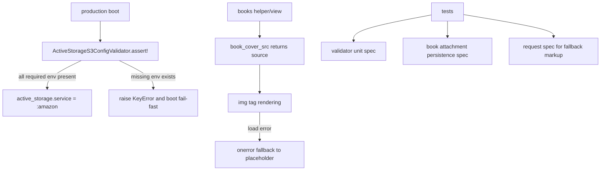

# 設計書

## アーキテクチャ概要

本対応は「設定ガード + 表示フォールバック + 回帰テスト」の3層で実装する。



## コンポーネント設計

### 1. `ActiveStorageS3ConfigValidator`

**責務**:
- production に必要な S3 環境変数の不足を判定する。
- 不足時に例外を発生させ、起動を fail-fast させる。

**実装の要点**:
- `REQUIRED_ENV_KEYS = %w[AWS_ACCESS_KEY_ID AWS_SECRET_ACCESS_KEY AWS_REGION AWS_S3_BUCKET]` を定義。
- `missing_keys(env)` と `assert!(env)` を提供し、テストしやすくする。

### 2. production 設定

**責務**:
- production で S3 構成を必須化する。

**実装の要点**:
- validator を呼び出してから `config.active_storage.service = :amazon` を設定。
- `:local` へのフォールバック分岐を削除。

### 3. 書影表示フォールバック

**責務**:
- 画像 URL が壊れている場合でもプレースホルダーを表示する。

**実装の要点**:
- 一覧・詳細の `` に `onerror` を付与し、画像非表示 + プレースホルダー表示へ切り替える。
- `books_helper` で URL 解析失敗時に warn ログを出力する。
- `BooksController#cover_proxy` の失敗経路で warn/error ログを追加する。

## データフロー

### production 起動時
1. production 初期化で validator を呼ぶ。
2. 不足キーがあれば例外を raise して起動失敗。
3. 問題なければ `:amazon` を Active Storage サービスとして利用する。

### 書影表示時
1. `book_cover_src` が添付画像 URL または外部 URL を返す。
2. view が `` を描画。
3. 画像読み込み失敗時、`onerror` で `` を隠しプレースホルダーを表示する。

## エラーハンドリング戦略

### 起動時エラー
- `KeyError` で不足環境変数を明示し、設定漏れを即時検知する。

### 画像表示エラー
- クライアント: 壊れ画像を隠してプレースホルダー表示。
- サーバー: `URI::InvalidURIError` や cover proxy 失敗時にログ出力。

## テスト戦略

### ユニットテスト
- validator が不足キーを正しく返す。
- validator が不足時に `KeyError` を raise する。

### モデル/統合テスト
- 2冊連続で添付したとき、先行書籍の `cover_image` が維持される。
- 書影表示に fallback 用マークアップ（`onerror` と placeholder）が含まれる。

### 既存回帰
- `bundle exec rspec`
- `bundle exec rubocop`

## 依存ライブラリ

新規追加なし。

## ディレクトリ構造

```
app/
	services/
		active_storage_s3_config_validator.rb   # 追加
	helpers/
		books_helper.rb                          # 更新
	controllers/
		books_controller.rb                      # 更新
	views/books/
		index.html.erb                           # 更新
		show.html.erb                            # 更新

config/environments/
	production.rb                              # 更新

spec/
	services/
		active_storage_s3_config_validator_spec.rb  # 追加
	models/
		book_spec.rb                                # 更新
	requests/
		books_spec.rb                               # 更新
```

## 実装の順序

1. validator 追加 + production 設定の fail-fast 化
2. 書影表示フォールバック（helper/view/controller ログ）
3. 回帰テスト追加
4. RSpec/RuboCop 実行と修正

## セキュリティ考慮事項

- ログには環境変数の値を出さず、キー名のみ出力する。
- 既存の `cover_proxy` の許可ドメイン制約は維持する。

## パフォーマンス考慮事項

- validator は起動時1回評価のみ。
- view の `onerror` は失敗時のみ動作し、通常表示パスに影響が小さい。

## 将来の拡張性

- validator は将来の追加必須設定キー（例: endpoint, path style）にも拡張可能。
- 画像ロード失敗通知をサーバーへ送る計測エンドポイント追加の土台として利用できる。
