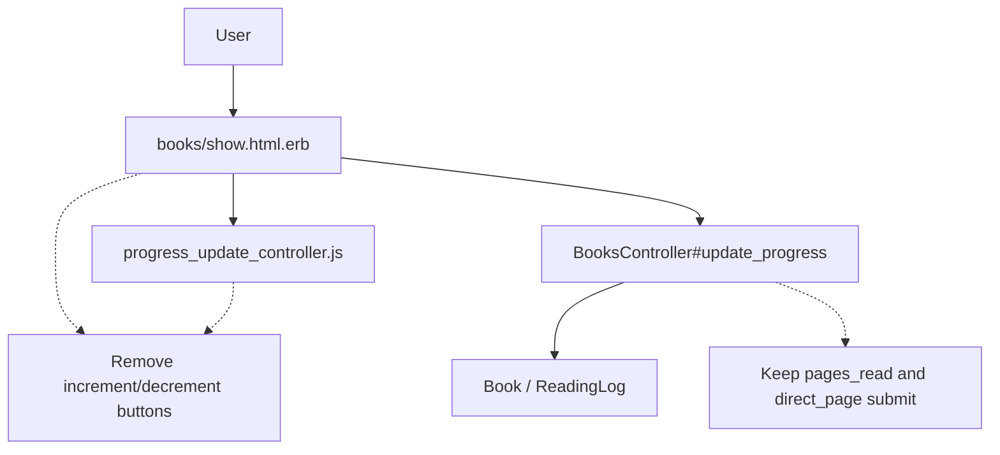

# 設計書

## アーキテクチャ概要

Railsの既存MVC構成を維持し、変更対象を View / Stimulus / Spec に限定する。進捗更新のサーバー処理（`BooksController#update_progress`）は現行仕様を維持し、UIの入力手段のみ整理する。



## コンポーネント設計

### 1. 書籍詳細の進捗更新フォーム（View）

**責務**:
- 進捗更新UIをページ数指定入力に統一する。
- direct_page 直接入力フォームの導線を維持する。

**実装の要点**:
- `pages_read` 入力欄の前後にあるステップボタンを削除。
- `data-controller` と `toggleAdvanced` は折りたたみ導線のため維持。

### 2. 進捗更新Stimulus（Controller）

**責務**:
- 直接入力セクションの開閉状態を制御する。

**実装の要点**:
- `increment` / `decrement` アクションと `pagesRead` / `max` の依存を削除。
- `toggleAdvanced` のみ残し、UI変更後も不要なターゲット定義が残らないようにする。

### 3. テスト（System / Request）

**責務**:
- 新仕様（ページ数指定のみ）を担保する。
- 既存の進捗保存ロジックが回帰しないことを確認する。

**実装の要点**:
- システムスペックの +/− ボタン前提テストを削除し、ボタン非表示の検証に置換。
- `pages_read` / `direct_page` の保存挙動は既存リクエストスペックで維持確認。

## データフロー

### 進捗更新（ページ数指定のみ）
```
1. ユーザーが pages_read 入力欄に読んだページ数を入力して送信
2. BooksController#update_progress が calculate_new_page で新しい現在ページを計算
3. Book更新とReadingLog記録をトランザクションで保存し、詳細画面へリダイレクト
```

## エラーハンドリング戦略

### カスタムエラークラス

新規クラスは追加しない。既存の `pages_read` / `direct_page` バリデーションエラー処理を利用する。

### エラーハンドリングパターン

- 不正入力時は `BooksController#update_progress` が `:unprocessable_entity` で `show` を再描画。
- 画面上には既存のフォームエラー表示をそのまま利用する。

## テスト戦略

### ユニットテスト
- 新規追加なし（ロジック変更がUI中心のため）。

### 統合テスト
- 進捗更新画面で +/− ボタンが表示されないことを確認。
- pages_read 入力による更新、direct_page 更新、異常系は既存スペックで回帰確認。

## 依存ライブラリ

追加なし。

## ディレクトリ構造

```text
app/views/books/show.html.erb                      # 進捗更新UIの整理
app/javascript/controllers/progress_update_controller.js  # 不要アクション削除
spec/system/books/progress_update_spec.rb          # UI仕様に合わせたテスト更新
.steering/20260527-issue243-progress-page-only/   # 計画/設計/進捗
```

## 実装の順序

1. 進捗更新画面のUIから +/− ボタンを削除する。
2. Stimulus から相対増減ロジックを削除し、折りたたみ制御のみ残す。
3. システムスペックを新UI仕様に合わせて更新する。
4. RSpec / RuboCop を実行して回帰を確認する。

## セキュリティ考慮事項

- パラメータ処理や権限境界は変更しない。
- 入力値バリデーションは既存のサーバー側検証を利用し、フロント変更に依存しない。

## パフォーマンス考慮事項

- UI要素削減によりクライアント側処理は軽量化される。
- サーバー側クエリやトランザクションには変更を加えない。

## 将来の拡張性

- 進捗入力方式を追加する場合は、Stimulusを責務分離してUIごとにコントローラーを分ける。
- 現在ページ直接入力導線を維持しているため、将来の入力補助追加時にも互換性を保ちやすい。
