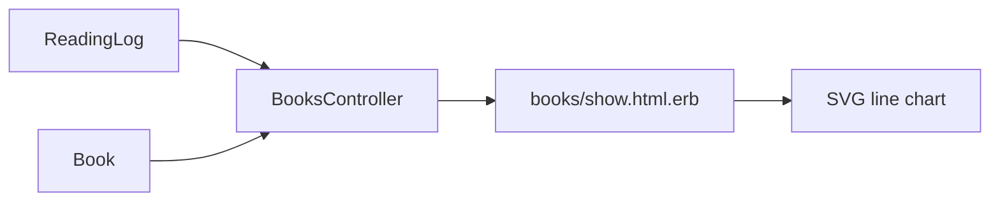

# 設計書

## アーキテクチャ概要

既存の Rails MVC 構成を維持し、`BooksController#show` でグラフ用の日次集計データを準備し、`books/show` ビューで SVG 折れ線グラフとして描画する。



## コンポーネント設計

### 1. BooksController

責務:
- 書籍詳細画面の表示に必要な読書ログの日次データを整形する
- 読了状態に応じてグラフ表示期間の終了日を決定する

実装の要点:
- `prepare_show_vars` にグラフデータ準備を追加し、`show` とバリデーションエラー再描画で共通化する
- 日付範囲は開始日から終了日まで全日を生成し、未記録日は `0` で補完する

### 2. books/show.html.erb

責務:
- 日別ページ数を折れ線グラフとして可視化する
- データなしの際に空状態を表示する

実装の要点:
- 外部ライブラリを使わず SVG の `polyline` と補助グリッド線で描画する
- アクセシビリティのため、補助テーブル（スクリーンリーダー向け）を併記する

### 3. books.css

責務:
- グラフセクション、軸ラベル、凡例、空状態のスタイルを提供する

実装の要点:
- 既存の BEM 命名規則に合わせて `book-show__chart-*` 系クラスを追加する
- モバイルで横スクロール可能な描画領域を確保する

## データフロー

### 書籍詳細画面表示
1. `BooksController#show` が `prepare_show_vars` を実行する
2. `prepare_progress_chart_data` で対象書籍の `reading_logs` を日付集計する
3. 期間全日を走査して `{date, pages_read}` 配列を生成する（未記録日=0）
4. ビューで配列を使い SVG の座標を計算して折れ線を描画する

## エラーハンドリング戦略

### エラーハンドリングパターン
- 日付関連値が不整合の場合（終了日 < 開始日）は開始日を終了日に補正して空配列化を回避する
- 読書ログが0件の場合はグラフを描かず、説明メッセージを表示する

## テスト戦略

### リクエストテスト
- 詳細画面にグラフセクションが表示されること
- 既存ログの日付・ページ数が反映されること
- ログ欠損日の 0 表示仕様が反映されること
- 読了本は読了日までで期間が切れること

## 依存ライブラリ

追加ライブラリなし。

## ディレクトリ構造

```
app/controllers/books_controller.rb
app/views/books/show.html.erb
app/assets/stylesheets/books.css
spec/requests/books_spec.rb
.steering/20260528-issue-250-reading-progress-chart/{requirements,design,tasklist}.md
```

## 実装の順序

1. ステアリング tasklist の定義
2. Controller にグラフ用データ整形ロジック追加
3. 詳細画面に SVG 折れ線グラフ UI を追加
4. CSS と Request spec を追加して回帰確認

## セキュリティ考慮事項

- 表示データは `current_user` の書籍に限定された `@book.reading_logs` を利用し、認可境界を維持する

## パフォーマンス考慮事項

- SQL 集計は `group(:read_at).sum(:pages_read)` を使い DB 側で実行する
- 表示期間は単一書籍単位で、描画計算は軽量な配列処理に限定する

## 将来の拡張性

- 将来的に週次/月次切り替えを追加できるよう、期間計算と日次データ生成を private メソッドとして分離する
