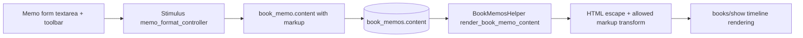

# 設計書

## アーキテクチャ概要

既存のRails MVCを維持し、メモ本文はDBにテキスト保存したまま、表示時に限定記法をサーバーサイド変換して反映する。クライアント側はStimulusで入力補助UI（太字/色）を提供する。



## コンポーネント設計

### 1. Memo Formatting Stimulus Controller

**責務**:
- textarea選択範囲に太字記法を挿入
- color pickerで選択色の記法を挿入

**実装の要点**:
- `selectionStart/selectionEnd` を用いて選択テキストをラップ
- 未選択時でもプレースホルダーテキストを挿入して編集可能にする

### 2. BookMemosHelperのレンダリング関数

**責務**:
- 許可記法のみHTMLへ変換
- 任意HTMLの無害化（エスケープ）

**実装の要点**:
- 先に`ERB::Util.html_escape`を適用
- `**text**` を`<strong>`へ、`[color=#RRGGBB]text[/color]` を`<span style="color:...">`へ変換
- 最終出力は`simple_format(..., sanitize: false)`で改行整形

## データフロー

### メモ作成/表示
```
1. ユーザーがフォームで装飾ボタンを操作し、記法付き本文を作成
2. book_memos#create / update が本文をそのまま保存
3. 表示時に helper が本文を安全変換してHTML描画
```

## エラーハンドリング戦略

### エラーハンドリングパターン

- 色コードが規約外の場合は変換せずプレーンテキストとして表示
- 記法が不完全な場合も生テキストとして扱い、例外を出さない

## テスト戦略

### ユニットテスト
- ヘルパーの記法変換結果（太字/色/エスケープ）

### 統合テスト
- メモ作成/更新時に装飾記法が保存されること
- show画面で変換後HTMLが描画されること

## 依存ライブラリ

新規ライブラリ追加なし（既存Rails + Stimulusの範囲で実装）。

## ディレクトリ構造

```
app/helpers/book_memos_helper.rb               # 装飾記法レンダリング
app/javascript/controllers/memo_format_controller.js # 入力補助UI
app/javascript/controllers/index.js            # Stimulus登録
app/views/books/show.html.erb                  # 追加フォームと表示でhelper利用
app/views/book_memos/edit.html.erb             # 編集フォームで装飾UI追加
spec/helpers/book_memos_helper_spec.rb         # 変換ロジック検証
spec/requests/book_memos_spec.rb               # 装飾保存/表示の回帰
```

## 実装の順序

1. helperで安全な記法変換を実装
2. フォームUIとStimulus入力補助を追加
3. 表示部分をhelper経由に変更
4. RSpecを追加・更新し、実行して検証

## セキュリティ考慮事項

- 任意HTMLは常にエスケープしてXSSを防止
- 色コードは`#RRGGBB`のみに制限し、style属性注入を防止

## パフォーマンス考慮事項

- 文字列変換のみで完結し、外部通信なし
- 対象は1メモ最大2000文字で、表示コストは軽量

## 将来の拡張性

- 許可記法の変換処理をhelperに集約し、将来の斜体/下線追加を容易化

