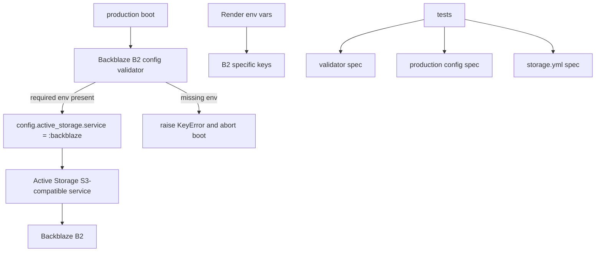

# 設計書

## アーキテクチャ概要

本対応は「B2 用ストレージ定義 + 起動時バリデーション + デプロイ設定更新 + 回帰テスト」の4層で実装する。



## コンポーネント設計

### 1. Backblaze B2 config validator

**責務**:
- production に必要な B2 環境変数の不足を判定する。
- 不足時に例外を発生させ、誤設定のまま起動しないようにする。

**実装の要点**:
- 必須キーを定数化し、テストから確認できるようにする。
- 値そのものはログに出さず、キー名のみをエラーに含める。

### 2. production 設定と storage.yml

**責務**:
- production で Backblaze B2 を唯一の保存先として使う。
- Active Storage のサービス定義を B2 の endpoint と path-style に合わせる。

**実装の要点**:
- production では validator を呼び出してから B2 サービスを有効化する。
- `config/storage.yml` に B2 用の service 定義を追加し、endpoint と `force_path_style` を設定する。
- AWS 前提のキー名を B2 用に差し替える。

### 3. デプロイ設定とドキュメント

**責務**:
- Render の環境変数一覧を B2 用に揃える。
- 運用者が必要な設定値を迷わず設定できるようにする。

**実装の要点**:
- `render.yaml` と `README.md`、関連ドキュメントの環境変数表記を一致させる。
- S3 互換であることは明記しつつ、実運用は Backblaze B2 を指すようにする。

## データフロー

### production 起動時
```
1. production 初期化で B2 validator を呼ぶ
2. 必須環境変数が足りなければ KeyError を raise して起動失敗する
3. 問題なければ Backblaze B2 service を Active Storage に設定する
```

### デプロイ設定反映時
```
1. Render の環境変数を B2 用に設定する
2. production 起動時の validator がその値を検証する
3. Active Storage が Backblaze B2 に接続する
```

## エラーハンドリング戦略

### カスタムエラークラス

新規の例外クラスは作成しない。起動失敗は `KeyError` で表現する。

### エラーハンドリングパターン

- 必須キーが不足している場合は、キー名だけを含むエラーメッセージで fail-fast する。
- B2 設定に関する値は秘匿し、ログや例外に環境変数値を出さない。

## テスト戦略

### ユニットテスト
- B2 validator が不足キーを正しく返す。
- B2 validator が不足時に `KeyError` を raise する。

### 統合テスト
- production 設定が Backblaze B2 validator と `:backblaze` サービスを参照する。
- `config/storage.yml` の B2 定義が必要な endpoint 付きで存在する。

## 依存ライブラリ

新規追加なし。

## ディレクトリ構造

```
app/
  services/
    active_storage_s3_config_validator.rb             # 更新
config/
  environments/
    production.rb                                     # 更新
  storage.yml                                         # 更新
render.yaml                                           # 更新
spec/
  services/
    active_storage_s3_config_validator_spec.rb          # 更新
  config/
    production_active_storage_config_spec.rb           # 更新
    storage_config_spec.rb                             # 追加
```

## 実装の順序

1. B2 validator と production 設定を更新する
2. `config/storage.yml` と `render.yaml` を B2 用に更新する
3. 回帰テストを追加する
4. RSpec / RuboCop で検証する

## セキュリティ考慮事項

- エラーやログに秘密情報を含めない。
- B2 endpoint は設定値として扱い、ハードコードを最小限にする。

## パフォーマンス考慮事項

- 起動時検証は 1 回だけ行う。
- Active Storage の利用パスは production 起動後に追加オーバーヘッドを増やさない。

## 将来の拡張性

- B2 以外の S3 互換サービスへ切り替える場合も、validator と `storage.yml` を差し替えやすい構造にする。
- 必須環境変数の追加があっても定数と spec を更新するだけで追従できる。
