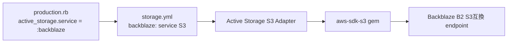

# 設計書

## アーキテクチャ概要

Rails の既存 MVC 構成は変更せず、インフラ境界（Active Storage のアダプタ解決）に対して依存 Gem を明示する最小変更で対応する。



## コンポーネント設計

### 1. Bundler 依存管理（Gemfile / Gemfile.lock）

責務:
- S3 サービスアダプタに必要な依存を解決可能にする。
- production 起動時の `Missing service adapter for "S3"` を防ぐ。

実装の要点:
- `Gemfile` へ `gem "aws-sdk-s3", require: false` を追加する。
- `Gemfile.lock` に解決済み依存（`aws-sdk-core` など）を反映させる。

### 2. Active Storage production 設定（既存維持）

責務:
- `:backblaze` 固定方針を維持する。
- B2 必須環境変数の fail-fast バリデーションを維持する。

実装の要点:
- `config/environments/production.rb` と `app/services/active_storage_s3_config_validator.rb` は設計意図を維持し、今回の修正では不用意に変更しない。

## データフロー

### production 起動時
1. Rails 起動時に `production.rb` が `ActiveStorageS3ConfigValidator.assert!` を実行する。
2. `config.active_storage.service = :backblaze` が設定される。
3. `storage.yml` の `backblaze: service: S3` を解決する。
4. `aws-sdk-s3` が読み込まれ、S3 アダプタが解決される。
5. アプリ起動が継続し、アップロード/表示処理が可能になる。

## エラーハンドリング戦略

### 既存エラー方針
- B2 必須環境変数不足時: `ActiveStorageS3ConfigValidator` が `KeyError` を送出し fail-fast。
- SENDGRID 未設定時: 警告ログのみ出力し、起動は継続。

### 今回の方針
- 依存 Gem 不足による Active Storage 起動失敗を、依存明示で予防する。

## テスト戦略

### ユニット/設定テスト
- `spec/config/storage_config_spec.rb`
- `spec/config/production_active_storage_config_spec.rb`
- `spec/services/active_storage_s3_config_validator_spec.rb`

### 静的解析
- `bundle exec rubocop`

## 依存ライブラリ

```json
{
	"dependencies": {
		"aws-sdk-s3": "bundler解決バージョン"
	}
}
```

## ディレクトリ構造

```text
変更:
- Gemfile
- Gemfile.lock

検証対象（既存）:
- config/storage.yml
- config/environments/production.rb
- app/services/active_storage_s3_config_validator.rb
- spec/config/storage_config_spec.rb
- spec/config/production_active_storage_config_spec.rb
- spec/services/active_storage_s3_config_validator_spec.rb
```

## 実装の順序

1. `Gemfile` に `aws-sdk-s3` が入っていることを確認・不足時追加。
2. `Gemfile.lock` へ依存解決結果を反映。
3. 対象RSpecとRuboCopを実行して回帰がないことを確認。

## セキュリティ考慮事項

- 機密情報（B2キー）は環境変数で管理し、コードに直書きしない。
- storage service を `:backblaze` に固定し、意図しない local fallback を許可しない。

## パフォーマンス考慮事項

- 依存 Gem 追加による起動時間への影響は小さく、起動失敗リスク低減を優先する。

## 将来の拡張性

- もし B2 以外の S3互換ストレージへ切替える場合でも、`service: S3` + 環境変数差し替えで対応可能な構成を維持する。
