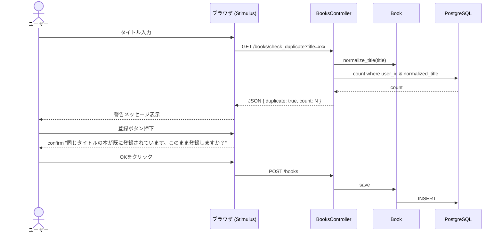

# 設計書

## アーキテクチャ概要

### 1. データベースとモデルの最適化
重複判定や回数計算を効率的に行うため、`books` テーブルに `normalized_title` カラムを追加し、保存時に自動設定する。これにより、SQL レベルで高速かつ安全な重複チェックと回数カウント、および前回の本の検索が可能になる。

### 2. 重複チェック API の新設
フロントエンドから非同期で重複を検知できるように、`BooksController#check_duplicate` エンドポイントを新設し、JSON 形式で重複判定結果を返却する。

### 3. フロントエンドの制御
Stimulus コントローラ `book-form` から上記 API を呼び出し、リアルタイムでの警告表示と送信時の確認ダイアログの表示を制御する。



## コンポーネント設計

### 1. データベース
- **テーブル変更**: `books`
- **追加カラム**: `normalized_title` (string, limit: 255)
- **インデックス**: `[:user_id, :normalized_title]`
- **バックフィル**: 既存の `Book` レコードの `title` から `normalized_title` を生成して保存する。

### 2. Book モデル
- **正規化ロジック**: `title.to_s.unicode_normalize(:nfkc).gsub(/\s+/, '').downcase`
- **コールバック**: `before_validation :set_normalized_title`
- **インスタンスメソッド**:
  - `reading_round`: 同一ユーザー内で、同じ `normalized_title` を持つ本のうち、自身が何番目に登録されたか（自分以下の ID を持つレコード数）を返す。
  - `display_title`: ビュー表示用のタイトル。`reading_round > 1` の場合は `タイトル(N回目)` を返し、それ以外は `title` を返す。
  - `previous_book`: 自分より ID が小さく、同じ `normalized_title` を持つ最新のレコードを返す。

### 3. BooksController
- **新設アクション**: `check_duplicate`
  - 認証済みユーザーのみアクセス可能。
  - パラメータ `title` を正規化し、`current_user.books.where(normalized_title: normalized_title_param)` の件数を取得。
  - 件数が 1 件以上あれば `{ duplicate: true, count: N }` を返す。

### 4. Stimulus `book-form` コントローラ & ビュー
- `book-form` コントローラに `checkDuplicate` メソッドを追加。タイトル入力時に非同期で API を叩く。
- 警告がある場合、タイトル入力欄の下に表示する。
- フォーム送信時（`submit`）イベントをインターセプトし、重複がある場合に `window.confirm` を表示する。

## テスト戦略

### ユニットテスト (Model)
- `spec/models/book_spec.rb`:
  - `normalized_title` が適切に設定されること（空白削除、全半角統一、大文字小文字無視）。
  - `reading_round` が正しく回数をカウントすること。
  - `display_title` が 2回目以降で回数を含むこと。
  - `previous_book` が前回の本を正しく取得できること。

### 統合テスト (Request)
- `spec/requests/books_spec.rb`:
  - `GET /books/check_duplicate` が正しい JSON を返すこと。

### システムテスト (System)
- `spec/system/books/duplicate_title_warning_spec.rb`:
  - 重複タイトル登録時の警告表示および確認ダイアログの挙動を検証。
  - 2回目以降のタイトル表示と前回リンクの存在・動作確認。

## ディレクトリ構造

```
app/
  controllers/
    books_controller.rb
  models/
    book.rb
  views/
    books/
      _form.html.erb
      show.html.erb
      index.html.erb
  javascript/
    controllers/
      book_form_controller.js
db/
  migrate/
    [TIMESTAMP]_add_normalized_title_to_books.rb
spec/
  models/
    book_spec.rb
  requests/
    books_spec.rb
  system/
    books/
      duplicate_title_warning_spec.rb
```
