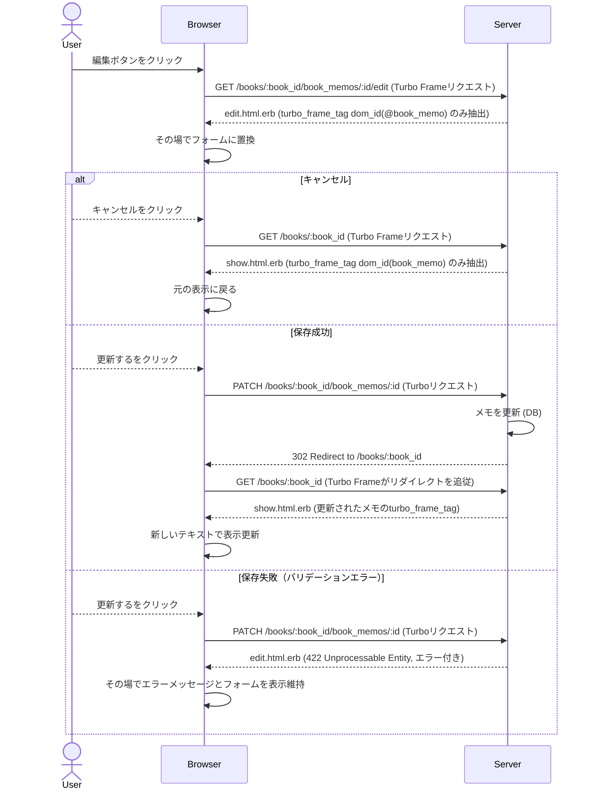

# 設計書

## アーキテクチャ概要

Railsの `Hotwire (Turbo)` を採用します。特に `turbo_frame_tag` を使用し、サーバーサイドでレンダリングされたHTMLの部分置換（インプレース編集）を実現します。



## コンポーネント設計

### 1. メモ部分テンプレート (`app/views/book_memos/_book_memo.html.erb`)

**責務**:
- 各メモの表示およびアクションボタン（編集・削除）のレンダリング。

**実装の要点**:
- `li` 要素全体を `turbo_frame_tag dom_id(book_memo), tag: :li, class: "memo-timeline__item"` で囲むことで、HTML構造やCSSクラスを壊さずに Turbo Frame 化する。

### 2. メモ編集ビュー (`app/views/book_memos/edit.html.erb`)

**責務**:
- メモ編集フォームのレンダリング。

**実装の要点**:
- `turbo_frame_tag dom_id(@book_memo)` でフォームとエラー表示を囲む。
- `form_with` の `data: { turbo: false }` を削除し、Turbo を有効化する。
- キャンセルボタンは `link_to 'キャンセル', book_path(@book)` とし、Turbo Frameリクエストとして処理されるようにする。

### 3. メモコントローラ (`app/controllers/book_memos_controller.rb`)

**責務**:
- メモの編集 (`edit`)、更新 (`update`) 処理のハンドリング。

**実装の要点**:
- `update` 成功時は `redirect_to @book` を返すが、Turboがリダイレクトに追従して部分更新するため、コントローラの成功時ロジックは変更しない。
- `update` 失敗時は `render :edit, status: :unprocessable_entity` でエラーを返す。この時、HTTPステータス `422` を返すことで Turbo が適切に画面置換を処理する。

## テスト戦略

### システムテスト
- `spec/system/books/detail_ui_states_spec.rb` に以下のテストを追加：
  - 書籍詳細画面でメモの「編集」をクリックすると、その場で編集フォームが表示されること。
  - 「キャンセル」をクリックすると、その場で元のメモ表示に戻ること。
  - 「更新する」をクリックすると、画面遷移せずにメモの内容が更新され、新しい内容が表示されること。
  - 空の内容で「更新する」をクリックした際、その場でバリデーションエラーが表示されること。

## ディレクトリ構造

```
app/
  controllers/
    book_memos_controller.rb (既存、挙動確認)
  views/
    book_memos/
      _book_memo.html.erb (修正)
      edit.html.erb (修正)
spec/
  system/
    books/
      detail_ui_states_spec.rb (テスト追加)
```

## 実装の順序

1. `feature` ブランチの作成。
2. `_book_memo.html.erb` に `turbo_frame_tag` を追加。
3. `edit.html.erb` に `turbo_frame_tag` を追加し、フォームの `turbo: false` を外す。
4. 手動動作検証および自動テスト (RSpec) の作成と実行。
5. RuboCopによる静的解析と修正。
