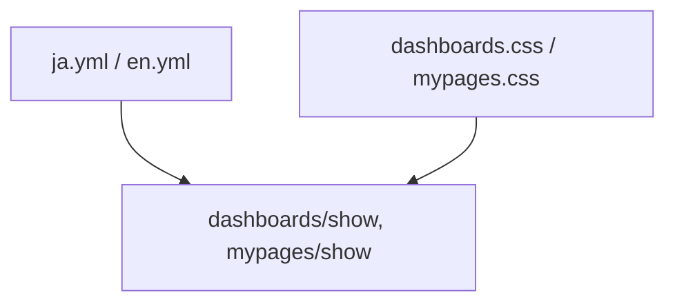

# 設計書

## アーキテクチャ概要

本機能はRailsのI18nの多言語化機能およびSCSS（CSS）のBEM設計に基づき、表示層（ビュー、スタイルシート、多言語化リソース）のみを修正するUI改善機能です。ビジネスロジック（モデル、コントローラ）の変更はありません。



## コンポーネント設計

### 1. 多言語化リソース（I18n）

**責務**:
- 数値に応じたストリークの適切な単位表記の管理（0 のときは「日」、1 以上のときは「日連続」など）。

**実装の要点**:
- `config/locales/ja.yml` および `config/locales/en.yml` に `streak.unit` を定義します。
- `count` キーを利用して、値による動的分岐を行います。

### 2. ビュー（ERB）

**責務**:
- 数値と単位を分割してHTMLタグを構成し、デザインをあてられるようにする。

**実装の要点**:
- 数値と単位の間に余分な空白が生じないよう、改行を挟まずにインライン要素として配置します。
- 単位は `t('streak.unit', count: value)` で取得します。

### 3. スタイルシート（CSS）

**責務**:
- 数値と単位のメリハリを付けたデザインの実現。

**実装の要点**:
- `dashboard__stat-unit` および `mypage__stat-unit` クラスを作成。
- フォントサイズや太さを調整し、数値の強調に合わせた控えめなサイズに調整します。

## データフロー

### ストリーク表示の描画
```
1. ユーザーがダッシュボードまたはマイページにアクセス
2. コントローラでストリーク日数（@streak_days / consecutive_reading_days）を取得
3. ビューで t('streak.unit', count: days) を呼び出し、ロケール定義に基づき単位を取得
4. CSS で数値（大）と単位（小）をスタイリングして画面描画
```

## テスト戦略

### システムテスト (RSpec)
- ダッシュボードおよびマイページを開いた際に、連続読書日数（ストリーク）が正しくフォーマットされて表示されること（0 の場合、1 以上の場合）を確認するテストを追加または更新します。
- 既存の System Spec を確認し、必要に応じて検証対象に追加します。

## ディレクトリ構造

```
app/
  assets/
    stylesheets/
      dashboards.css (修正)
      mypages.css (修正)
  views/
    dashboards/
      show.html.erb (修正)
    mypages/
      show.html.erb (修正)
config/
  locales/
    ja.yml (修正)
    en.yml (修正)
```

## 実装の順序

1. ロケール定義ファイル (`ja.yml`, `en.yml`) の修正
2. ダッシュボードのビュー (`dashboards/show.html.erb`) と CSS (`dashboards.css`) の修正
3. マイページのビュー (`mypages/show.html.erb`) と CSS (`mypages.css`) の修正
4. 動作確認とテスト作成・更新
