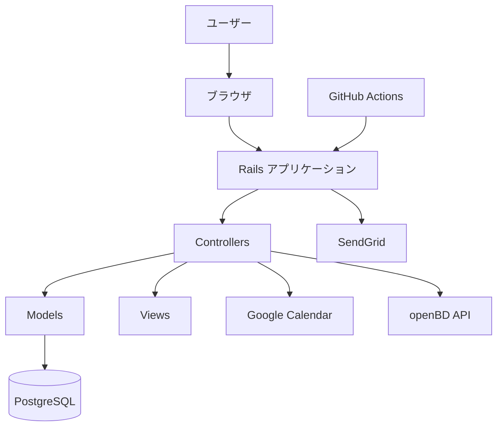
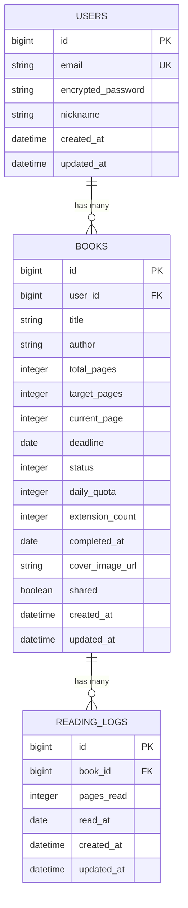
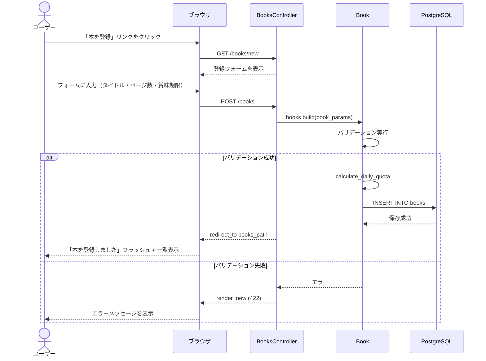
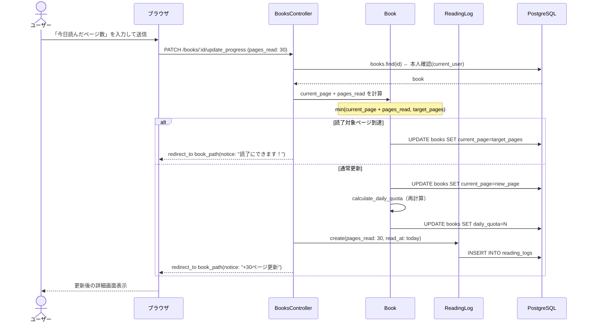
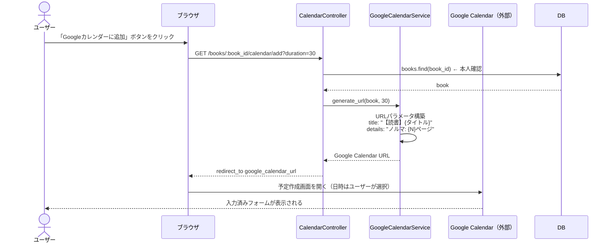

# 機能設計書 (Functional Design Document)

## システム構成図



---

## 技術スタック

| 分類 | 技術 | バージョン | 選定理由 |
|------|------|-----------|----------|
| 言語 | Ruby | 3.2.x | Rails 7.2との互換性、開発速度 |
| フレームワーク | Ruby on Rails | 7.2.x | 安定性、豊富なエコシステム、MVCアーキテクチャ |
| データベース | PostgreSQL | 16.x | リレーショナルデータ、Neonの無料枠、JSON型サポート |
| 認証 | Devise | 4.9.x | Railsでのデファクトスタンダード、セキュア |
| テスト | RSpec | 3.12.x | BDD、豊富なマッチャー、読みやすい |
| 静的解析 | RuboCop | 1.x | コード品質の維持、統一的なスタイル |
| デプロイ先 | Render | - | 無料枠、自動デプロイ、HTTPS自動対応 |
| ホスティング | Neon (PostgreSQL) | - | 無料枠、自動バックアップ |

---

## データモデル定義

### エンティティ: User（ユーザー）

```ruby
# app/models/user.rb
class User < ApplicationRecord
  # Devise modules
  devise :database_authenticatable, :registerable,
         :recoverable, :rememberable, :validatable

  has_many :books, dependent: :destroy

  # バリデーション
  validates :email, presence: true, uniqueness: true
  validates :nickname, length: { maximum: 50 }
end
```

**スキーマ**:
```ruby
create_table :users do |t|
  t.string :email, null: false
  t.string :encrypted_password, null: false
  t.string :nickname, limit: 50
  t.string :reset_password_token
  t.datetime :reset_password_sent_at
  t.datetime :remember_created_at
  t.timestamps
end

add_index :users, :email, unique: true
add_index :users, :reset_password_token, unique: true
```

**制約**:
- メールアドレスは一意
- パスワードはbcryptでハッシュ化
- ニックネームは最大50文字（任意）

---

### エンティティ: Book（積読本）

```ruby
# app/models/book.rb
class Book < ApplicationRecord
  belongs_to :user

  # 列挙型
  enum status: { unread: 0, reading: 1, completed: 2 }

  # バリデーション
  validates :title, presence: true, length: { maximum: 255 }
  validates :total_pages, presence: true, numericality: { greater_than: 0, only_integer: true }
  validates :target_pages, presence: true, numericality: { greater_than: 0, only_integer: true }
  validates :current_page, presence: true, numericality: { greater_than_or_equal_to: 0, only_integer: true }
 validates :deadline, presence: true
  validate :deadline_cannot_be_in_the_past, on: :create
  validate :target_pages_within_total_pages
  validate :current_page_within_target_pages

  # スコープ
  scope :active, -> { where.not(status: :completed) }
  scope :by_deadline, -> { order(deadline: :asc) }
  scope :overdue, -> { where('deadline < ?', Date.today).where.not(status: :completed) }

  # コールバック
  before_save { self.daily_quota = calculate_daily_quota }

  # ビジネスロジック
  def remaining_pages
    target_pages - current_page
  end

  def remaining_days
    return 0 if deadline < Date.today
    (deadline - Date.today).to_i + 1  # 今日を含む
  end

  def calculate_daily_quota
    return 0 if remaining_pages <= 0 || remaining_days <= 0
    (remaining_pages.to_f / remaining_days).ceil
  end

  def progress_percentage
    return 0 if target_pages.zero?
    ((current_page.to_f / target_pages) * 100).round(1)
  end

  def days_until_deadline
    (deadline - Date.today).to_i
  end

  def overdue?
    deadline < Date.today && status != 'completed'
  end

  def deadline_class
    return 'book-cover--overdue' if overdue?
    days = days_until_deadline
    return 'book-cover--days-1' if days <= 1
    return 'book-cover--days-3' if days <= 3
    return 'book-cover--days-7' if days <= 7
    nil
  end
end
```

**スキーマ**:
```ruby
create_table :books do |t|
  t.references :user, null: false, foreign_key: true
  t.string :title, null: false, limit: 255
  t.string :author, limit: 255
  t.integer :total_pages, null: false
  t.integer :target_pages, null: false
  t.integer :current_page, null: false, default: 0
  t.date :deadline, null: false
  t.integer :status, null: false, default: 0  # 0: unread, 1: reading, 2: completed
  t.integer :daily_quota
  t.integer :extension_count, null: false, default: 0
  t.date :completed_at
  t.string :cover_image_url
  t.boolean :shared, null: false, default: false
  t.timestamps
end

add_index :books, :user_id
add_index :books, :deadline
add_index :books, :status
add_index :books, [:user_id, :deadline]
```

**制約**:
- タイトルは必須、最大255文字
- 総ページ数、読了対象ページ数は1以上
- 現在ページは0以上
- 読了対象ページ数 ≤ 総ページ数
- 現在ページ ≤ 読了対象ページ数
- 期限は今日以降（新規作成時）

---

### エンティティ: ReadingLog（読書記録）

```ruby
# app/models/reading_log.rb
class ReadingLog < ApplicationRecord
  belongs_to :book

  validates :pages_read, presence: true, numericality: { greater_than: 0, only_integer: true }
  validates :read_at, presence: true
end
```

**スキーマ**:
```ruby
create_table :reading_logs do |t|
  t.references :book, null: false, foreign_key: true
  t.integer :pages_read, null: false
  t.date :read_at, null: false
  t.timestamps
end

add_index :reading_logs, [:book_id, :read_at]
```

**制約**:
- 読んだページ数は1以上
- 読書日は必須

---

### ER図



---

## コンポーネント設計

### プレゼンテーション層（Controllers & Views）

#### `config/routes.rb`

**責務**: MVPで利用する画面遷移とカスタムアクションのルーティング定義

```ruby
Rails.application.routes.draw do
  devise_for :users

  root 'home#index'

  resources :books do
    member do
      patch :update_progress
      patch :change_deadline
      patch :complete
    end

    resource :calendar, only: [], controller: 'calendar' do
      get :add
    end
  end
end
```

#### BooksController

**責務**: 積読本のCRUD操作、進捗更新、期限変更

```ruby
# app/controllers/books_controller.rb
class BooksController < ApplicationController
  before_action :authenticate_user!
  before_action :set_book, only: [:show, :edit, :update, :destroy, :update_progress, :change_deadline, :complete]

  # GET /books
  def index
    @books = current_user.books.active.by_deadline
    @completed_books = current_user.books.completed.order(completed_at: :desc)
  end

  # GET /books/:id
  def show
    @daily_quota = @book.calculate_daily_quota
    @reading_logs = @book.reading_logs.order(read_at: :desc).limit(10)
  end

  # GET /books/new
  def new
    @book = current_user.books.build
  end

  # POST /books
  def create
    @book = current_user.books.build(book_params)
    if @book.save
      redirect_to books_path, notice: '本を登録しました'
    else
      render :new, status: :unprocessable_entity
    end
  end

  # GET /books/:id/edit
  def edit
  end

  # PATCH /books/:id
  def update
    if @book.update(book_params)
      redirect_to book_path(@book), notice: '本を更新しました'
    else
      render :edit, status: :unprocessable_entity
    end
  end

  # DELETE /books/:id
  def destroy
    @book.destroy
    redirect_to books_path, notice: '本を削除しました'
  end

  # PATCH /books/:id/update_progress
  def update_progress
    pages_read = params[:pages_read].to_i

    if pages_read > 0
      new_current_page = [@book.current_page + pages_read, @book.target_pages].min
      # unread → reading への自動遷移
      new_status = @book.unread? ? :reading : @book.status
      @book.update(current_page: new_current_page, status: new_status)

      # 読書記録を作成
      @book.reading_logs.create(pages_read: pages_read, read_at: Date.today)
      
      # 読了達成チェック
      if new_current_page >= @book.target_pages
        redirect_to book_path(@book), notice: "進捗を更新しました（+#{pages_read}ページ）。読了にできます！"
      else
        redirect_to book_path(@book), notice: "進捗を更新しました（+#{pages_read}ページ）"
      end
    else
      redirect_to book_path(@book), alert: '読んだページ数を入力してください'
    end
  end

  # PATCH /books/:id/change_deadline
  def change_deadline
    new_deadline = params[:book][:deadline]

    ActiveRecord::Base.transaction do
      @book.update!(deadline: new_deadline)
      @book.increment!(:extension_count)
    end
    redirect_to book_path(@book), notice: '期限を変更しました'
  rescue ActiveRecord::RecordInvalid
    redirect_to book_path(@book), alert: '期限の変更に失敗しました'
  end

  # PATCH /books/:id/complete
  def complete
    @book.update(status: :completed, completed_at: Date.today)
    redirect_to book_path(@book), notice: '🎉 読了おめでとうございます！'
  end

  private

  def set_book
    @book = current_user.books.find(params[:id])
  end

  def book_params
    params.require(:book).permit(
      :title, :author, :total_pages, :target_pages,
      :current_page, :deadline, :cover_image_url
    )
  end
end
```

#### CalendarController

**責務**: Googleカレンダー連携（簡易版・URL生成）

```ruby
# app/controllers/calendar_controller.rb
class CalendarController < ApplicationController
  before_action :authenticate_user!

  # GET /books/:book_id/calendar/add
  def add
    @book = current_user.books.find(params[:book_id])
    @duration = params[:duration] || 30  # デフォルト30分
    @google_calendar_url = GoogleCalendarService.generate_url(@book, @duration)
    
    # Google Calendar URLへリダイレクト
    redirect_to @google_calendar_url, allow_other_host: true
  end
end
```

---

### サービス層（Services）

#### GoogleCalendarService

**責務**: Googleカレンダー URL生成

```ruby
# app/services/google_calendar_service.rb
class GoogleCalendarService
  def self.generate_url(book, duration_minutes = 30)
    title = "【読書】#{book.title}"
    details = "今日のノルマ: #{book.daily_quota}ページ\n残り: #{book.remaining_pages}ページ"
    
    # 終了時刻を計算（所要時間から）
    # Google Calendarは日時をユーザーが設定するため、durationのみ指定
    # duration は HHMM 形式（例: 30分 → "0030"）
    duration_hhmm = format('%02d%02d', duration_minutes / 60, duration_minutes % 60)
    params = {
      action: 'TEMPLATE',
      text: title,
      details: details,
      duration: duration_hhmm
    }
    
    "https://calendar.google.com/calendar/render?#{params.to_query}"
  end
end
```

#### DailyQuotaCalculatorService

**責務**: ノルマ計算ロジックの集約

```ruby
# app/services/daily_quota_calculator_service.rb
class DailyQuotaCalculatorService
  def self.recalculate_all
    Book.active.find_each do |book|
      book.daily_quota = book.calculate_daily_quota
      book.save(validate: false)  # バリデーションをスキップ
    end
  end

  def self.recalculate_for_book(book)
    book.daily_quota = book.calculate_daily_quota
    book.save(validate: false)
  end
end
```

Please continue reading the file for the complete functional design document...


---

## ユースケースシーケンス図

### 1. 積読登録フロー



### 2. 進捗更新とノルマ再計算フロー



### 3. Googleカレンダー連携フロー（簡易版）



---

## エラーハンドリング

### エラーの分類と対処方針

| エラー種別 | 例 | 対処方法 | ユーザー向け表示 |
|-----------|-----|---------|----------------|
| バリデーションエラー | タイトル未入力、ページ数が0以下 | フォームを再表示（422） | エラーメッセージをフォーム上に表示 |
| 認可エラー | 他ユーザーの本にアクセス | `ActiveRecord::RecordNotFound`で404 | 404ページを表示 |
| 外部APIエラー（openBD） | API応答なし、isbn未ヒット | nilチェック、手入力にフォールバック | 「書籍情報が取得できませんでした。手入力してください」 |
| 外部APIエラー（Google Calendar） | URL生成失敗 | URLを空にして詳細ページに戻る | 「カレンダー連携に失敗しました」アラート |
| DBエラー | 接続失敗、制約違反 | `rescue ActiveRecord::ActiveRecordError` | 「システムエラーが発生しました。しばらく後にお試しください」 |

### コントローラーレベルのエラーハンドリング

```ruby
# app/controllers/application_controller.rb
class ApplicationController < ActionController::Base
  rescue_from ActiveRecord::RecordNotFound, with: :not_found
  rescue_from ActionController::InvalidAuthenticityToken, with: :invalid_token

  private

  def not_found
    render file: 'public/404.html', status: :not_found, layout: false
  end

  def invalid_token
    redirect_to root_path, alert: 'セッションが切れました。再度操作してください。'
  end
end
```

### バリデーションエラーのUI表示

```erb
<%# app/views/shared/_form_errors.html.erb %>
<% if object.errors.any? %>
  <div class="alert alert-danger">
    <h4><%= object.errors.count %>件のエラーがあります</h4>
    <ul>
      <% object.errors.full_messages.each do |msg| %>
        <li><%= msg %></li>
      <% end %>
    </ul>
  </div>
<% end %>
```

### 外部APIエラーのフォールバック

```ruby
# app/services/open_bd_service.rb
class OpenBdService
  API_ENDPOINT = 'https://api.openbd.jp/v1/get'
  TIMEOUT_SECONDS = 5

  def self.find_by_isbn(isbn)
    response = HTTParty.get(API_ENDPOINT, query: { isbn: isbn }, timeout: TIMEOUT_SECONDS)
    return nil unless response.success?

    data = response.parsed_response&.first
    return nil if data.nil?

    {
      title: data.dig('summary', 'title'),
      author: data.dig('summary', 'author'),
      cover_url: data.dig('summary', 'cover')
    }
  rescue Net::OpenTimeout, Net::ReadTimeout
    Rails.logger.warn("openBD API timeout for ISBN: #{isbn}")
    nil  # nilを返してフォールバック
  rescue StandardError => e
    Rails.logger.error("openBD API error: #{e.message}")
    nil
  end
end
```

---

## テスト戦略

### テストの設計方針

```
        /\
       /E2E\       ← System Specs（3〜5件）: 主要ユースケース全体
      /──────\
     /  統合   \    ← Request Specs（主要アクションを網羅）
    /──────────\
   /    単体    \   ← Model Specs（90%以上カバレッジ）
  /──────────────\
```

### 単体テスト - Model Specs（最優先）

**対象**: ビジネスロジック、バリデーション、スコープ

```ruby
# spec/models/book_spec.rb

RSpec.describe Book, type: :model do
  # --- ノルマ計算 ---
  describe '#calculate_daily_quota' do
    context '正常系: 残181ページ、4日間' do
      let(:book) { build(:book, target_pages: 300, current_page: 119, deadline: 3.days.from_now.to_date) }
      it '⌈181/4⌉ = 46を返す' do
        expect(book.calculate_daily_quota).to eq(46)
      end
    end

    context '残ページが0の場合' do
      let(:book) { build(:book, target_pages: 260, current_page: 260) }
      it '0を返す' do
        expect(book.calculate_daily_quota).to eq(0)
      end
    end

    context '期限が今日の場合（残日数=1）' do
      let(:book) { build(:book, target_pages: 100, current_page: 0, deadline: Date.today) }
      it '100を返す' do
        expect(book.calculate_daily_quota).to eq(100)
      end
    end

    context '期限が過去の場合' do
      let(:book) { build(:book, deadline: 1.day.ago.to_date) }
      it '0を返す' do
        expect(book.calculate_daily_quota).to eq(0)
      end
    end
  end

  # --- バリデーション ---
  describe 'バリデーション' do
    it { should validate_presence_of(:title) }
    it { should validate_numericality_of(:total_pages).is_greater_than(0) }
    it { should validate_numericality_of(:target_pages).is_greater_than(0) }
    it { should validate_numericality_of(:current_page).is_greater_than_or_equal_to(0) }

    describe '期限が過去の場合' do
      let(:book) { build(:book, deadline: 1.day.ago.to_date) }
      it '無効である' do
        expect(book).to be_invalid
      end
    end

    describe '読了対象ページ > 総ページ数の場合' do
      let(:book) { build(:book, total_pages: 200, target_pages: 300) }
      it '無効である' do
        expect(book).to be_invalid
      end
    end
  end

  # --- スコープ ---
  describe 'スコープ' do
    describe '.active' do
      let!(:unread)    { create(:book, status: :unread) }
      let!(:reading)   { create(:book, status: :reading) }
      let!(:completed) { create(:book, status: :completed) }

      it '未読と読書中のみ返す' do
        expect(Book.active).to match_array([unread, reading])
      end
    end

    describe '.by_deadline' do
      let!(:far)  { create(:book, deadline: 7.days.from_now.to_date) }
      let!(:near) { create(:book, deadline: 1.day.from_now.to_date) }

      it '期限の近い順に並ぶ' do
        expect(Book.by_deadline).to eq([near, far])
      end
    end
  end
end
```

### 統合テスト - Request Specs

**対象**: コントローラーのHTTPレスポンス、認証確認

```ruby
# spec/requests/books_spec.rb

RSpec.describe 'Books', type: :request do
  let(:user) { create(:user) }
  let(:book) { create(:book, user: user) }

  # 認証なしアクセスのテスト
  describe '未ログイン' do
    it 'GET /books はログイン画面にリダイレクト' do
      get books_path
      expect(response).to redirect_to(new_user_session_path)
    end
  end

  describe 'POST /books（本登録）' do
    before { sign_in user }

    context '正常系' do
      let(:valid_params) { { book: attributes_for(:book) } }

      it '本が作成される' do
        expect { post books_path, params: valid_params }.to change(Book, :count).by(1)
      end

      it '一覧画面にリダイレクト' do
        post books_path, params: valid_params
        expect(response).to redirect_to(books_path)
      end
    end

    context '異常系: タイトル未入力' do
      let(:invalid_params) { { book: attributes_for(:book, title: '') } }

      it 'ステータス422が返る' do
        post books_path, params: invalid_params
        expect(response).to have_http_status(:unprocessable_entity)
      end
    end
  end

  describe 'PATCH /books/:id/update_progress（進捗更新）' do
    before { sign_in user }

    it '現在ページが加算される' do
      expect {
        patch update_progress_book_path(book), params: { pages_read: 20 }
        book.reload
      }.to change(book, :current_page).by(20)
    end

    it '他ユーザーの本は更新できない（404）' do
      other_book = create(:book)
      patch update_progress_book_path(other_book), params: { pages_read: 10 }
      expect(response).to have_http_status(:not_found)
    end
  end
end
```

### E2Eテスト - System Specs（主要3ケース）

```ruby
# spec/system/reading_flow_spec.rb

RSpec.describe '読書管理フロー', type: :system do
  let(:user) { create(:user) }

  before do
    driven_by(:selenium_chrome_headless)
    sign_in user
  end

  it 'ユーザーは本を登録してノルマを確認できる' do
    visit new_book_path
    fill_in 'タイトル', with: 'リーダブルコード'
    fill_in '総ページ数', with: '260'
    fill_in '読了対象ページ数', with: '260'
    fill_in '読了期限', with: 7.days.from_now.to_date.strftime('%Y-%m-%d')
    click_button '登録する'

    expect(page).to have_content('本を登録しました')
    expect(page).to have_content('今日のノルマ')
  end

  it 'ユーザーは進捗を更新できる' do
    book = create(:book, user: user, current_page: 100, target_pages: 260,
                  deadline: 7.days.from_now.to_date)
    visit book_path(book)
    fill_in '今日読んだページ数', with: '30'
    click_button '更新する'

    expect(page).to have_content('進捗を更新しました')
    expect(page).to have_content('130')
  end

  it '期限が近いと賞味期限ビジュアライザーが適用される' do
    create(:book, :urgent, user: user)
    visit books_path

    expect(page).to have_css('.book-cover--days-1')
  end
end
```
